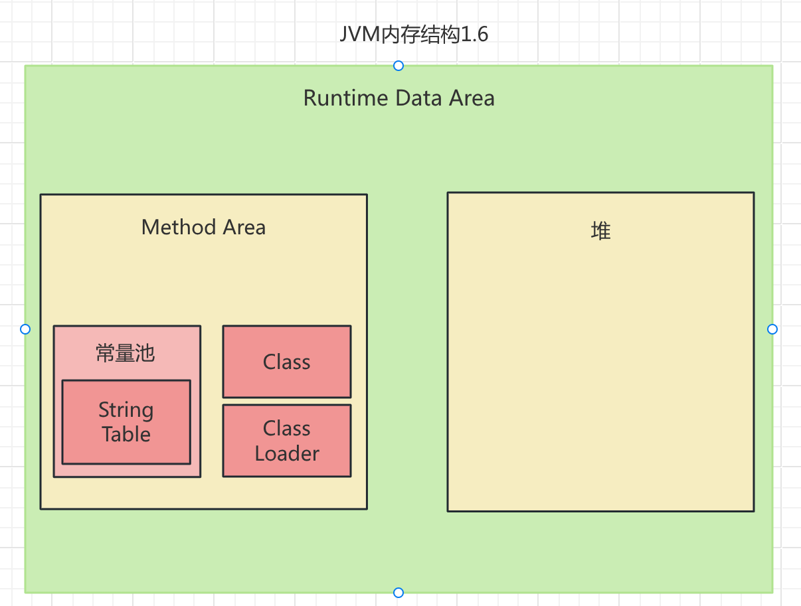
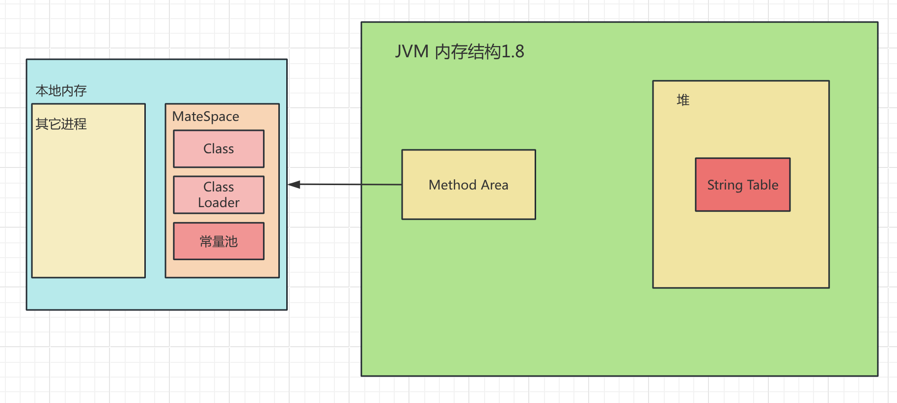
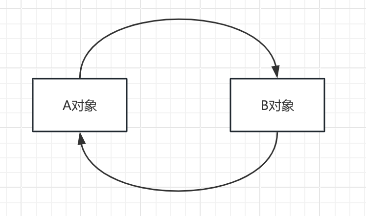

# JVM快速入门篇

**Java虚拟机**（英语：Java Virtual Machine**JVM**），一种能够执行[Java字节码](https://zh.wikipedia.org/wiki/Java字节码)的[虚拟机](https://zh.wikipedia.org/wiki/虛擬機器)，以[堆栈结构机器](https://zh.wikipedia.org/wiki/堆疊結構機器)来实现。最早由[Sun微系统](https://zh.wikipedia.org/wiki/昇陽電腦)所研发并实现第一个实现版本，是[Java平台](https://zh.wikipedia.org/wiki/Java平臺)的一部分，能够执行以[Java](https://zh.wikipedia.org/wiki/Java)语言写作的[软件](https://zh.wikipedia.org/wiki/軟體)程序。

## 1、JVM的位置

## 2、JVM的体系结构

## 3、类加载器

## 4、双亲委派机制

## 5、沙箱安全机制


# JVM详解篇

## 内存结构


### 1、程序计数器（Program Counter Register）

#### 1、定义

Program Counter Register程序计数器，程序计数器在 JVM 内存结构中是一个非常小但非常重要的区域。你可以把它想象成**一个微型的指针，时刻指向当前线程正在执行的字节码指令地址**。


程序计数器的作用简单来说，就是记录下一条jvm指令的执行地址。


JVM指令执行流程：

​	jvm指令 -> 解释器 -> 机器码 -> CPU				

​      

#### 2、特点：

- 线程私有
- 在jvm中，唯一不会出现内存溢出


### 2、Java虚拟机栈

>栈帧（Frame）是 JVM 栈（Stack）的基本单位，每一个方法从调用开始到执行结束，都对应着一个栈帧在 JVM 栈中从入栈到出栈的过程。
>
>栈帧中主要保存了方法执行所需的所有信息，其核心内容包括：
>
>------
>
>##### 1. 局部变量表（Local Variables）
>
>- **作用**：用于存储方法的参数和方法内部定义的局部变量。
>- **内容**：基本数据类型（如 `int`, `boolean`）的值直接保存在这里；而引用类型（如 `String`, 对象）的引用地址则保存在这里，它们指向堆中实际的对象。
>- **特点**：局部变量表的大小在编译时就已经确定，并且一个栈帧中局部变量表的容量是固定的。
>
>##### 2. 操作数栈（Operand Stack）
>
>- **作用**：作为方法执行时的“工作区”，用于存放操作数和中间计算结果。
>- **内容**：JVM 执行指令时，会将数据从局部变量表或堆中加载到操作数栈上，进行计算，然后再将结果存回局部变量表或堆中。
>- **特点**：操作数栈遵循先进后出（FILO）的原则。例如，执行 `int a = 1 + 2;` 时，`1` 和 `2` 会先被压入操作数栈，然后执行加法指令，最后将结果 `3` 弹出并存入局部变量表中。
>
>##### 3. 动态链接（Dynamic Linking）
>
>- **作用**：每个栈帧都包含一个指向运行时常量池中该栈帧所属方法的引用。这个引用用于在方法执行过程中将符号引用转换为直接引用。
>- **内容**：在程序运行时，如果一个方法调用另一个方法，就需要通过动态链接来找到被调用的方法的具体入口地址。
>
>##### 4. 方法返回地址（Return Address）
>
>- **作用**：当一个方法执行完毕后，需要知道回到哪里继续执行。方法返回地址就是用来保存调用该方法指令的地址。
>- **内容**：当方法正常返回或抛出异常时，JVM 会根据返回地址来恢复上层方法的执行。
>
>------
>
>总而言之，一个栈帧就相当于一个方法的“执行环境”，它将方法执行所需的所有数据和状态都封装在了一起，确保了方法的独立和有序执行。

#### 1、概念

- 每个线程运行时所需要的内存，称之为虚拟机栈
- 每个栈由多个栈帧（Frame）组成，对应着每次方法调用时所占用的内存
- 每个栈只能有一个活动栈帧，对应着当前正在执行的那个方法

>栈是一个先入后出、后入先出的数据结构，相当于弹夹。方法就是子弹，入栈就是压弹的过程，出栈就是出弹的过程。一个线程只有一个活动栈，对应着一把枪只能装备一个弹夹。
>
>
>
>在这个Demo中，有三个方法，分别是main、method1、method2.在左下角可以看到，main方法已经入栈了，点击下一步，mehtod1就会入栈。


#### 2、问题辨析：

- 垃圾回收是否涉及栈内存？
  - 不涉及，因为栈内存就是一次次方法调用产生的栈帧内存，当方法执行完毕后，都会出栈，出栈的内存会被自动回收掉。
- 栈内存分配越大越好吗？
  - 栈内存可以在运行java代码时指定，在linux和MacOs上其默认大小是1024KB。因为jvm的内存总大小是固定的，你的栈内存越大，对应的线程数量就要变小，因为一个线程对应一个栈，而总内存由是不变的。
- 方法区内的局部变量是否线程安全？
  - 看变量是否线程安全，其实就是看这个变量对于线程来说是共享的还是私有的。
  - 如果是局部变量就不会产生线程安全问题
  - 如果是static的变量，就需要考虑线程安全问题
  - 如果方法内的局部变量没有逃离方法的作用范围，它是线程安全的。否则可能出现线程安全问题。所谓的逃离方法区的作用范围，就是通过return返回了这个局部变量。


#### 3、栈内存溢出

栈内存溢出（StackOverflowError）：**程序在执行过程中，因为调用方法所占用的栈空间超过了虚拟机所能提供的最大栈容量，导致内存空间用尽而发生的错误。**

通常发生在以下两种情况：

1. 栈帧过多导致栈内存溢出（无限递归）：
2. 栈帧过大导致内存溢出：
   - 帧帧（方法）的内存过大，直接大于栈的大小。一般情况下是不会发生的，因为一个int才4个字节，而栈有1024K大小。


#### 4、线程运行诊断

- 案例1:cpu占用过多
  - 在linux系统中，使用top命令定位哪个进程对cpu的占用过高
  - 使用 ps H pid,tid,%cpu 进程号 来判断是那个线程的cpu占用率过高
  - 使用jstack 加线程号查询，到底是哪条代码导致的cpu占用率过高。需要注意的是，在ps命令中，线程号是使用十进制，在jstack中是16进制。

- 案例2:程序运行时长很长时间没有结构
  - 可能是发生了线程死锁

### 3、本地方法栈

用于存储和管理由非 Java 语言（通常是 C 或 C++）编写的**本地方法**（Native Method）的调用。

### 4、堆（Heap）

#### 1、定义

> 堆是 JVM 中最大的一块内存区域，也是所有线程共享的。它唯一的目的就是存放**对象实例**和**数组**。
>
> 当你使用 `new` 关键字创建一个对象时，这个对象（包括它的成员变量）都会被分配到堆内存中。
>
> 
>
> 总结来说，**对象本身的所有数据（成员变量）都存在堆里**。而指向这个对象的**引用**则存在于栈或方法区（如果它是静态变量）中。


- 通过`new`关键字，创建的对象都会使用堆内存
- 特点
  - 它是线程共享的，堆中对象都需要考虑线程安全的问题
  - 有垃圾回收机制

#### 2、堆内存溢出（`OutOfMemoryError: Java heap space`）

它表示**当程序试图在堆上分配新的对象时，但堆的可用空间已经不足，并且垃圾回收器也无法腾出足够的空间来满足这次分配请求时，所抛出的错误。**

通常是由以下原因造成的：

1. **内存泄漏（Memory Leak）**：这是最常见的原因。当程序中创建了大量对象，但在使用完毕后，这些对象依然被某些引用（比如集合类、缓存等）所持有，导致垃圾回收器无法对其进行回收。随着时间的推移，这些“垃圾”对象会越积越多，最终耗尽堆空间。
2. **创建了太多大型对象**：程序在短时间内创建了数量巨大或体积庞大的对象，迅速消耗了所有堆内存。例如，一次性从数据库查询了数百万条记录并将其全部加载到内存中。
3. **堆内存设置过小**：通过JVM启动参数（如 `-Xmx` 和 `-Xms`）设置的堆空间太小，无法满足程序的正常运行需求。


#### 3、堆内存诊断

1. jps工具
   - 查看当前系统中有哪些java进程
2. jmap工具（只能查看某时刻）
   - 查看堆内存占用情况
3. jconsole工具
   - 图形界面，多功能的检测工具，可以连续监测


### 5、方法区

#### 1、概念


JVM 中的方法区（Method Area）是一个所有线程共享的内存区域，它在 JVM 启动时创建。这个区域主要用于存储类加载过程中所需的各种元数据和信息。

> 简单来说，方法区保存了与**类**相关的所有信息，而不是与**对象实例**相关的信息。

方法区中主要保存的内容包括：

##### 1. 类的基本信息（Class Metadata）

- **类的版本信息**：例如，Java 版本号。
- **字段（Field）信息**：包括字段的名称、类型、修饰符（如 `public`, `private`, `static` 等）。
- **方法（Method）信息**：包括方法的名称、返回类型、参数列表、修饰符，以及方法的字节码（`bytecode`）。
- **父类和接口信息**：该类继承自哪个父类，以及实现了哪些接口。


##### 2. 运行时常量池（Runtime Constant Pool）

- 这是方法区的一部分，用于存放各种**字面量**（Literal）和**符号引用**（Symbolic Reference）。
- **字面量**：
  - 字符串字面量（例如：`"hello"`）
  - 基本数据类型常量（例如：`final int a = 10;`）
- **符号引用**：
  - 类和接口的全限定名
  - 字段的名称和描述符
  - 方法的名称和描述符


##### 3. 静态变量（Static Variables）

- 所有类的静态变量（`static` 变量）都存储在方法区中。这些变量与类本身绑定，而不是与任何实例绑定。

##### 4. JIT 编译后的代码

- 如果 JVM 使用了即时编译器（JIT），那么 JIT 编译后的本地机器代码也会存储在方法区中。

------

**特别说明：**

从 **Java 8** 开始，方法区的概念被 **元空间（Metaspace）** 所取代。元空间使用的不是 JVM 内存，而是本地内存（Native Memory）。虽然存储位置发生了变化，但元空间存储的内容本质上与之前方法区所存储的内容是相同的，即类的元数据、运行时常量池和静态变量等。


方法区（Method Area）是Java虚拟机（JVM）的一部分，是所有线程共享的内存区域。

它的主要作用是**存储已被JVM加载的类信息**，这些信息在程序的整个生命周期内通常是静态且不变的。

方法区里存放的内容包括：

- **类和接口的元数据**：比如类的版本、字段、方法、父类和接口等。
- **运行时常量池（Runtime Constant Pool）**：每个类和接口的常量池，里面包含各种字面量（如字符串、基本数据类型常量）和符号引用。
- **静态变量**：类级别的静态变量。
- **即时编译器（JIT Compiler）编译后的代码**。


根据Oracle官方文档，方法区的核心定义如下：

- **所有线程共享的内存区域**：方法区在JVM启动时创建，是所有线程共享的。
- **存储类和接口的元数据**：它用于存储已经被虚拟机加载的类和接口的结构信息，包括运行时常量池、字段（Field）和方法（Method）数据，以及方法的字节码等。
- **非堆内存**：方法区虽然在逻辑上属于堆的一部分，但它的实现可以根据具体JVM来决定。例如，在JDK 8之前，它通常通过永久代（PermGen）实现，作为堆的一部分。而在JDK 8及之后，它由元空间（Metaspace）实现，使用本地内存，并且不再是堆的一部分。
- **不强制要求垃圾回收**：虽然方法区是运行时数据区的一部分，但规范并没有强制要求它必须进行垃圾回收。不过，即使有垃圾回收，其回收对象也主要是废弃的类和常量。


#### 2、内存图

在以下结构图中，我只标出了堆内存，其他的于这里无关，故进行了省略。

JVM内存结构1.6版




JVM内存结构1.8



永久代为于JVM中，MateSpace位于本地内存中。本地内存大于等于JVM内存，故MateSpace更不容易发生内存溢出。


#### 3、方法区内存溢出


#### 4、常量池的作用：

- 常量池就是一张表，虚拟机指令根据这张常量表找到要执行的类名、方法名、参数类型、字面量等信息。
- 运行是常量池，常量池是*.class文件中的，当该类被加载，它的常量池信息就会放入运行时常量池，并把里面的符号地址变为真实地址。

#### 5、StringTable


根据javap解析class可知， s1 + s2 = new StringBuilder().append("a").append("b").toString();, 而toString()的原理是:

```java
@Override
public String toString() {
    // Create a copy, don't share the array
    return new String(value, 0, count);
}
```


在Java 7及之前的版本中，字符串常量池位于永久代（PermGen）中，其容量是固定的，由参数`-XX:StringTableSize`设置。如果永久代满了，就会抛出`OutOfMemoryError: PermGen space`。但从Java 7更新开始，字符串常量池被移到了堆中，成为了一个普通的哈希表。

现代JDK版本（Java 8及以后）的**字符串常量池是基于哈希表实现的，它的容量是可变的，并且会自动进行扩容**。当哈希表的加载因子（load factor）达到某个阈值时，JVM会自动创建一个更大的哈希表，并将旧表中的所有元素重新散列（rehash）到新表中。


>特别注意：**字符串常量保存到栈中，字符串的引用对象保存到堆中**
>
>也就是说`String text = "hello world!"`；在这条语句下，"hello world!"这个字符是保存在栈中的，但是它的引用对象`text`是保存在堆中的


##### StringTable的特性：

- 常量池中的字符仅是符号，第一次用到时才变为对象。

- 利用串池的机制，来避免重复创建字符串对象。

- 字符串变量拼接原理是StringBuilder(); 注意是JVM1.8。

- 字符串常量拼接原理是编译期优化。

  - 如果常量池中有了字符串常量拼接后的结果，那么JVM不会创建新的对象，而是让这个变量指向常量池中的位置。

- 可以使用intern方法，主动将串池中还没有的字符串对象放入串池中。

  - JVM1.8中`intern()` 方法是 Java `String` 类的一个核心方法，它的主要作用是把一个字符串对象添加到 **StringTable**（字符串常量池）中。

    这个方法的工作机制可以概括为以下两点：

    1. **查找**：当调用 `intern()` 方法时，它会首先在字符串常量池中查找是否已经存在一个与该字符串对象内容相等的字符串。
    2. **入池**：
       - **如果找到了**：`intern()` 方法会直接返回常量池中那个已存在字符串的引用。
       - **如果没找到**：该方法会将当前这个字符串对象的引用**添加到**字符串常量池中，然后返回这个新入池的引用。

  - JVM1.6中`intern()` 方法是 Java `String` 类的一个核心方法，它的主要作用是把一个字符串对象添加到 **StringTable**（字符串常量池）中。

    这个方法的工作机制可以概括为以下两点：

    1. **查找**：当调用 `intern()` 方法时，它会首先在字符串常量池中查找是否已经存在一个与该字符串对象内容相等的字符串。
    2. **入池**：
       - **如果找到了**：`intern()` 方法会直接返回常量池中那个已存在字符串的引用。
       - **如果没找到**：该方法会将当前这个字符串对象的引用**添加到**字符串常量池中，然后返回这个新入池的引用。

##### StringTable的位置

- 为什么要在JVM1.8的时候，把StringTable的位置迁移出永久代？
  - 因为永久代的空间有限且GC效率低下。将`StringTable`移到堆中，意味着池中的字符串对象可以像普通的Java对象一样，被更高效、更频繁的垃圾回收器（如Young GC, Old GC）管理，从而避免了因字符串过多而导致的 `PermGen space` 内存溢出。


##### StringTable垃圾回收

StringTable中的字符串字面量也是可以被垃圾回收的。回收的条件和普通Java对象一样。


##### StringTable性能调优

- 调整StringTable的容量

  - Java 7及之后，`StringTable`的默认容量是 `1009`。当存储的字符串数量超过这个值时，哈希表会进行扩容，导致性能下降。如果你的应用需要存储大量字符串，可以通过JVM参数来调整`StringTable`的容量，从而避免频繁扩容。

    使用`-XX:StringTableSize`参数来设置容量。通常，这个值应该设为一个质数，以减少哈希冲突。

- 考虑将字符串对象是否入池


#### 6、直接内存（Direct Memory）

##### 1、定义

直接内存（Direct Memory）是Java虚拟机（JVM）使用的内存区域之一，但它**不在Java堆（Heap）内部**。它是由操作系统直接管理的，而不是由JVM的垃圾回收器（GC）管理。


##### 2、常用于NIO操作时，用于数据缓冲区


用上图可知，java读取磁盘文件，需要系统内存先读取，读取到系统缓冲区，然后在交给java缓冲区。


这个Direc Memory（直接内存），系统内存可以进行操作，Java内存也可以进行操作，因此减少了一次或多次的数据拷贝

> **直接内存的优势**在于它消除了这个“拷贝”的中间步骤。当使用直接内存时，数据可以直接从内核缓冲区读写到直接内存，或者从直接内存直接写入内核缓冲区，从而**减少了一次或多次数据拷贝**。这对于处理大量数据和高并发的场景（如Netty框架）来说，可以显著提高性能。


##### 3、不受JVM内存回收管理

直接内存（Direct Memory）是受 Unsafe对象管理的，直接内存的释法需要主要调用Unsafe对象的freeMomory方法

##### 4、分配和回收原理

- 使用Unsafe对象完成直接内存的分配回收，并且回收需要主动调用FreeMemory方法


### 6、垃圾回收

#### 1、如何判断对象可以回收

- 引用计数法

  - 当一个对象被引用时，引用计数器就加1，当引用计数器为零时，就进行垃圾回收。

  - 弊端：

    - 循环引用时，会导致不能进行垃圾回收。

      

- 可达性分析算法

  - 通过一系列被称为“GC Roots”的根对象作为起始点，从这些根对象开始向下搜索，搜索所走过的路径被称为**引用链（Reference Chain）**。如果一个对象到GC Roots没有任何引用链相连，则证明此对象是不可达的，也就意味着它不再被任何活跃的引用所持有，可以被判定为**可回收对象**。

- 四种引用

  - 强引用
    - 只有没有被引用时，才会被垃圾回收
  - 软引用
    - 当一个对象不存强引用，只有软引用时，但内存不够时才会被回收
  - 弱引用
    - 当一个对象不存强引用，只有弱引用时，只要进垃圾回收就会被回收
  - 虚引用
  - 终结器引用

#### 2、垃圾回收算法

#### 3、分代垃圾回收
